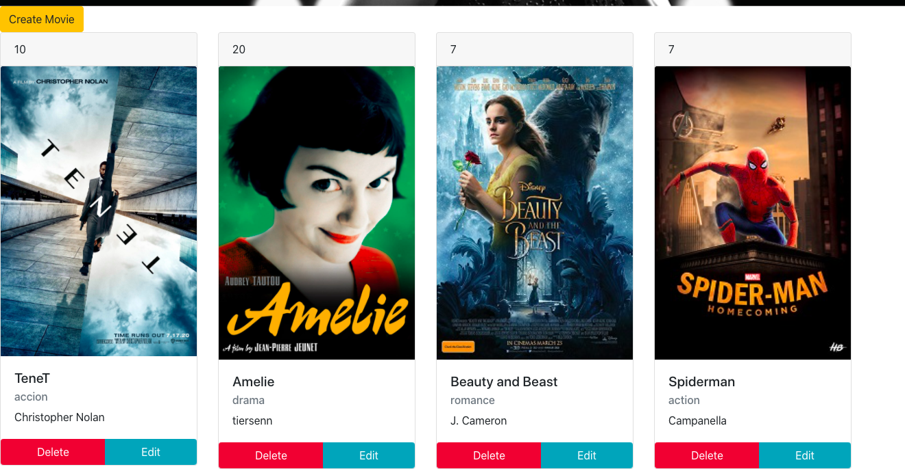

# Start the project

## Installation

- Install globally Fake Api Server

    ` sudo npm install -g json-server `

- Run Json

    ` json-server -p 3001 --watch peliculas.json `

- Run App

    ` npm run start `

- Run test

    ` npm run test `

## Excercise for the Bootbamp F5

- CRUD of movies made in react with react testing library.

### Screenshots 

#### Carousel Slider

#### Movie Cards

#### Create Movie Form

#### Edit Movie Form

